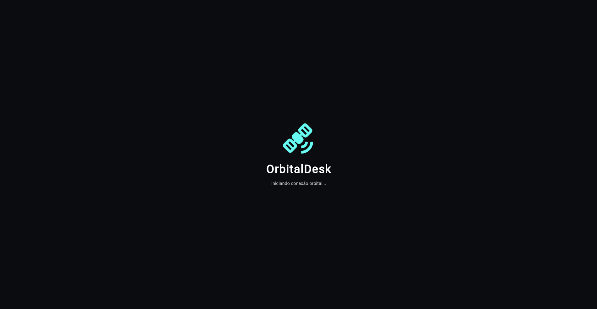
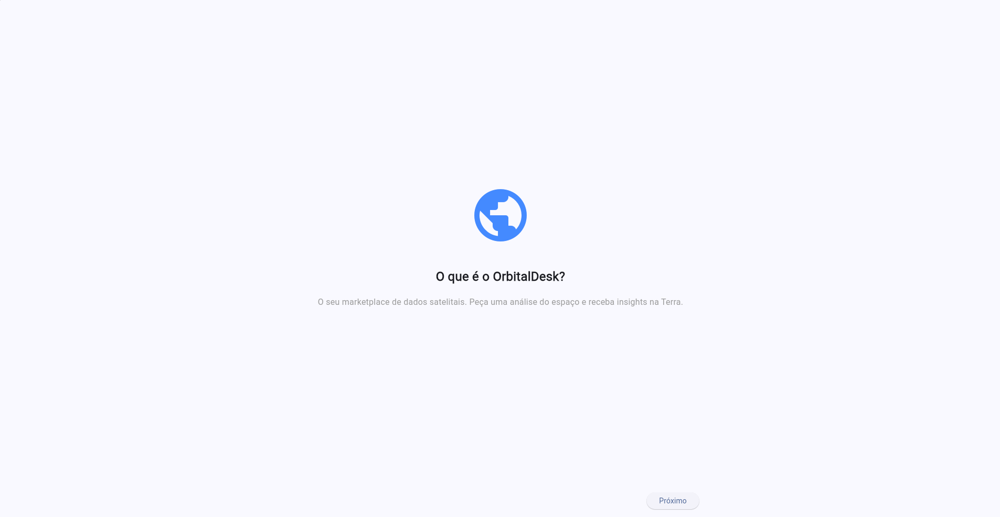
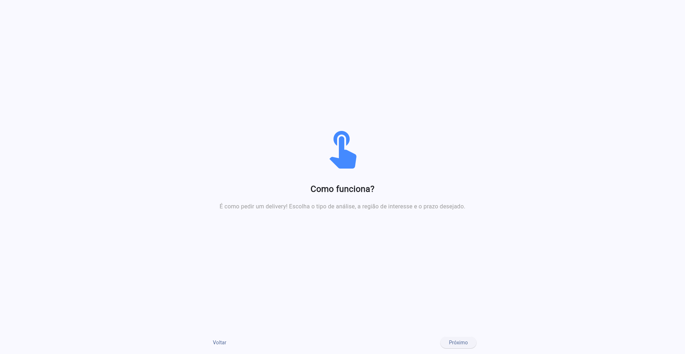
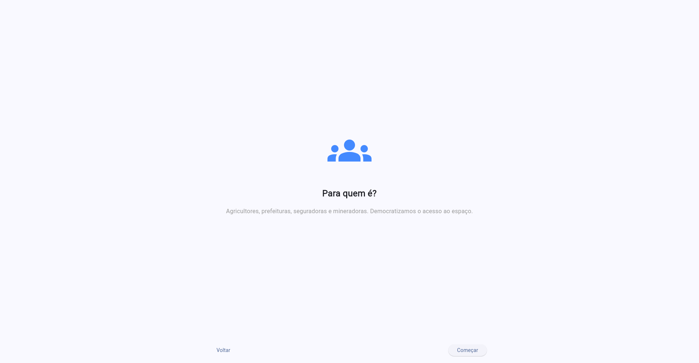
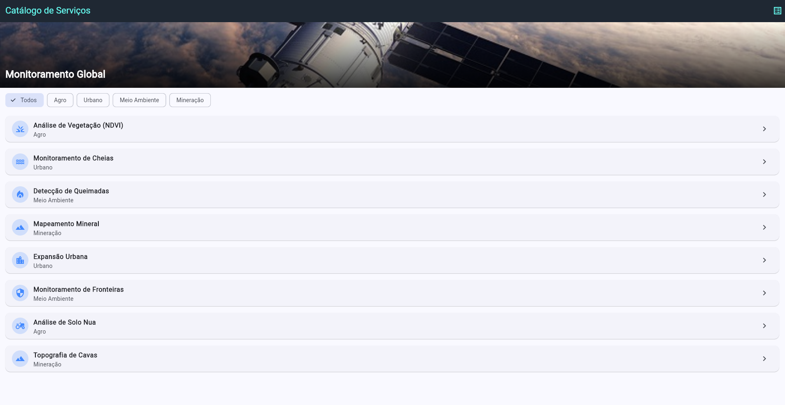
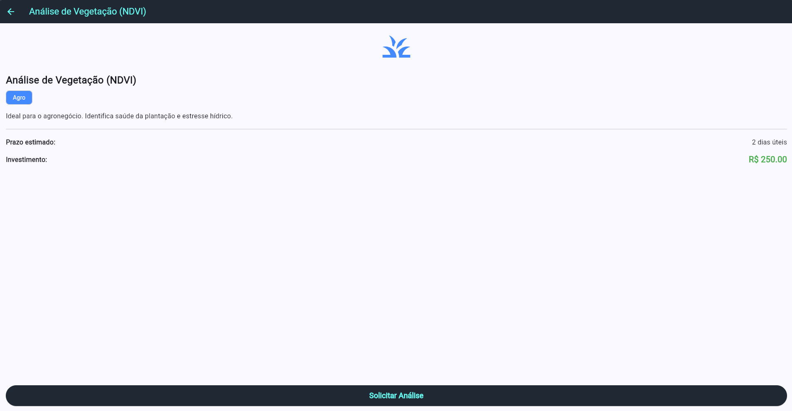
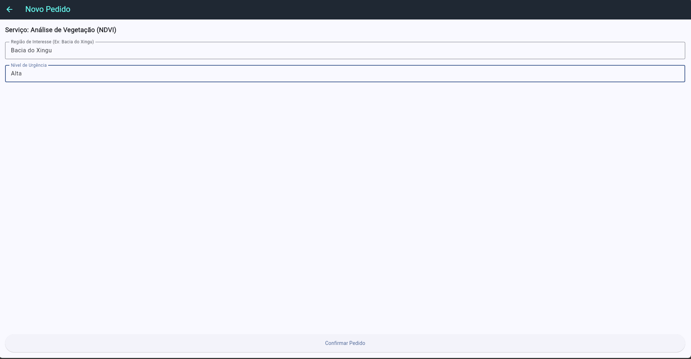
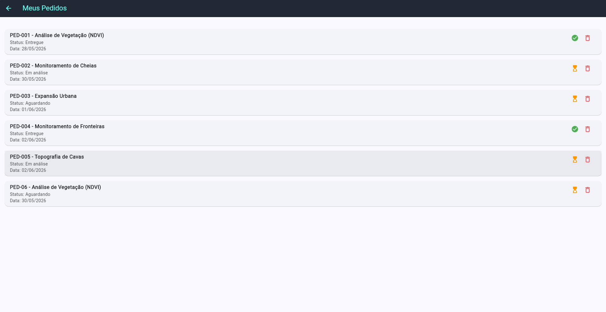
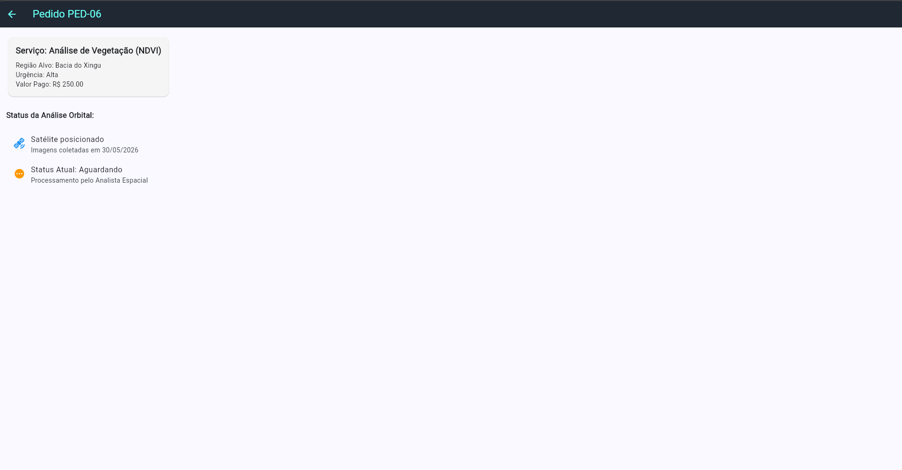

# 🛰️ OrbitalDesk

> Marketplace de dados satelitais aplicados a desafios reais na Terra.
> **FIAP — Global Solution 2026.1 | Space Connect**
> Disciplina: Desenvolvimento Cross Platform | Prof. Heider Pinholi Lopes

---

## 📌 Sobre o Projeto

O **OrbitalDesk** é um aplicativo mobile desenvolvido em **Flutter** que conecta a economia espacial a setores produtivos da sociedade. Por meio da plataforma, agricultores, prefeituras, mineradoras e seguradoras podem solicitar análises baseadas em dados de satélite — como monitoramento de vegetação, detecção de queimadas, mapeamento de cheias e topografia de minas — de forma simples, rápida e acessível.

---

## 🎯 Problema e Solução

**Problema:** dados de satélite de alta qualidade são usados por grandes agências (NASA, ESA, INPE), mas o acesso a essas informações por pequenos e médios produtores, municípios e empresas é burocrático, caro e fragmentado.

**Solução:** o OrbitalDesk atua como um marketplace que abstrai essa complexidade. O usuário escolhe o tipo de análise que precisa, informa a região de interesse e o nível de urgência, e recebe o relatório com os dados processados — como se fosse um pedido de entrega.

**ODS Relacionados:** ODS 2 (Fome Zero e Agricultura Sustentável), ODS 9 (Indústria, Inovação e Infraestrutura), ODS 11 (Cidades Sustentáveis), ODS 13 (Ação Climática).

---

## 📱 Telas do Aplicativo

### Fluxo principal

```
SplashScreen → OnboardingScreen (3 páginas) → HomeScreen
                                                    ↓
                                          ServiceDetailScreen
                                                    ↓
                                         RequestServiceScreen
                                                    ↓
                                            HomeScreen ← (popUntil)
                                                    ↓
                                           MyOrdersScreen
                                                    ↓
                                           OrderDetailScreen
```

### 📸 Screenshot e descrição das telas

#### Splash

<p align="center">
  
</p>
Logo do app com ícone de satélite, fundo escuro, transição automática
<p></p>

---

#### Onboarding (3 páginas)

<p align="center">
  
  
  
</p>
"O que é o OrbitalDesk?" — marketplace de dados satelitais 
<p></p>
"Como funciona?" — peça como um delivery
<p></p>
"Para quem é?" — agricultores, prefeituras, mineradoras
<p></p>
---

#### Catálogo de Serviços (HomeScreen)

<p align="center">
  
</p>
Banner de imagem, filtro por categoria, lista de 8 serviços
<p></p>
---

#### Detalhe do Serviço → Novo Pedido

<p align="center">
  
  
</p>
Ícone, descrição, prazo, preço e botão de solicitação |
Formulário com região e urgência, cria pedido real na lista
<p></p>
---

#### Meus Pedidos → Detalhe do Pedido

<p align="center">
  
  
</p>
Lista de pedidos com status e ícone de cor, opção de deletar | Histórico do satélite, status atual, botão de download (entregues)
<p></p>
---

## 👥 Equipe

| Nome                        | RM        |
| --------------------------- | --------- |
| _Enzo Demitrius Carvalhaes_ | RM 558912 |
| _Rafael Vitor de Almeida_   | RM 559116 |
| _Vitor Silva Batista_       | RM 558865 |

---

## 🎬 Pitch

> Link do vídeo no YouTube: https://youtu.be/vzrnQ3tBUyg

---

## Link do projeto

> https://github.com/lkd8/orbitaldeskflutter
